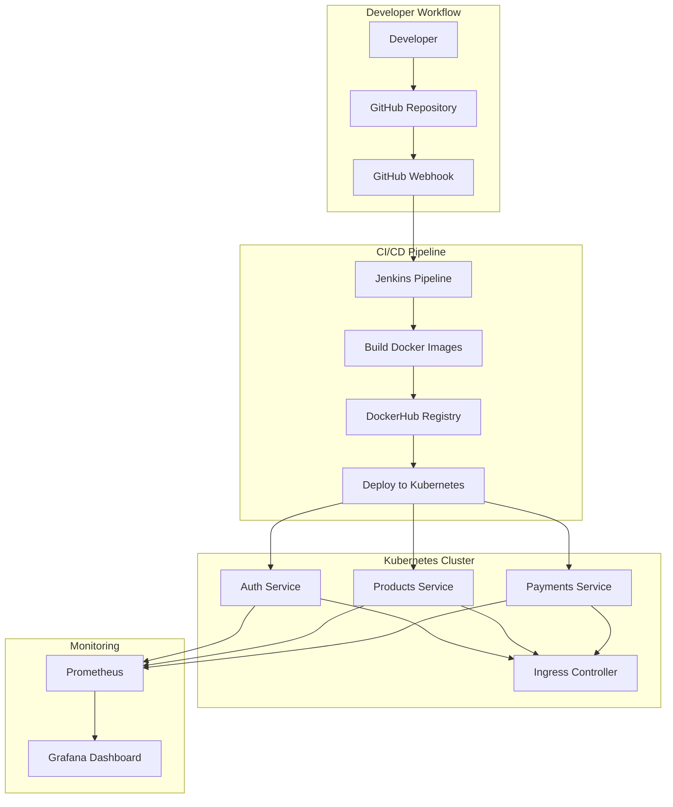

# DevOps Microservices CI/CD Pipeline Project

[]() []() []() []()

A comprehensive **student-level DevOps project** showcasing CI/CD pipeline implementation for deploying containerized microservices using Jenkins, Docker, Kubernetes, AWS, and monitoring with Prometheus & Grafana.


## 🏗️ Architecture Overview



## 🎯 Project Features

### Core Tech Stack
- 🐳 Docker & Docker Compose
- ☸️ Kubernetes (Minikube/EKS)
- ⚙️ Jenkins CI/CD + GitHub Webhooks
- 📦 Helm Charts
- 📈 Prometheus & Grafana
- ☁️ AWS EKS
- 🧠 Node.js Microservices

### Microservices
- 🔐 `auth-service` – Login, JWT
- 📦 `products-service` – Product catalog
- 💳 `payments-service` – Payment API

## 🚀 Quick Setup

```bash
# Clone the repo
git clone https://github.com/Atharva-04/CI-CD-Pipeline
cd CI-CD-Pipeline

# Build & Run
docker-compose up --build
```

## 🔁 Jenkins Pipeline Flow

```groovy
pipeline {
  agent any
  environment {
    SERVICE_NAME = "auth-service"
    DOCKER_IMAGE = "03atharva/${env.SERVICE_NAME}:latest"
  }
  stages {
    stage('Checkout') {
      steps {
        git branch: 'main', url: 'https://github.com/Atharva-04/CI-CD-Pipeline.git'
      }
    }
    stage('Build Docker Image') {
      steps {
        dir("microservices/${env.SERVICE_NAME}") {
          script {
            sh "docker build -t ${DOCKER_IMAGE} ."
          }
        }
      }
    }
    stage('Run Tests') {
      steps {
        dir("microservices/${env.SERVICE_NAME}") {
          sh 'npm install'
          sh 'npm test'
        }
      }
    }
    stage('Push Image') {
      when {
        branch 'main'
      }
      steps {
        withCredentials([usernamePassword(credentialsId: 'dockerhub', usernameVariable: 'DOCKER_USER', passwordVariable: 'DOCKER_PASS')]) {
          sh "echo $DOCKER_PASS | docker login -u $DOCKER_USER --password-stdin"
          sh "docker push ${DOCKER_IMAGE}"
        }
      }
    }
  }
}
```

## 📂 Project Layout

```
CI-CD-Pipeline/
├── microservices/
│   ├── auth-service/
│   ├── products-service/
│   └── payments-service/
├── kubernetes/
├── jenkins/
└── docker-compose.yml
```


## 🧠 Learning Outcomes

- ✅ Hands-on CI/CD with Jenkins
- ✅ K8s deployment via manifests & Helm
- ✅ GitHub → Jenkins automation
- ✅ Docker best practices

## 🙌 Acknowledgements

- Jenkins & K8s Docs
- Community StackOverflow warriors
- Self-teaching + trial & error 😤

## 💫 Resume Worthy Project

If you're a student trying to flex DevOps chops — this one slaps 💥  
Feel free to fork, clone, extend, or star ⭐
